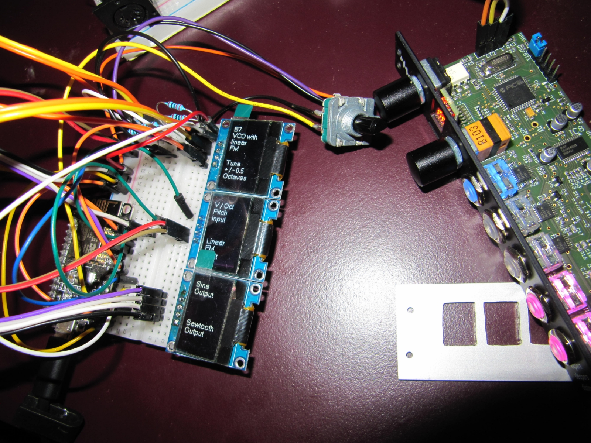
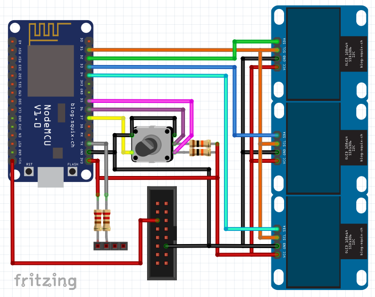

# disting-mk4-labels
Arduino based eurorack module displaying text on OLED displays

## Parts
-  [Expert Sleepers - disting mk4 Eurorack module](https://www.expert-sleepers.co.uk/downloads/manuals/disting_user_manual_4.20.pdf)
-  [NodeMCU](https://i2.wp.com/randomnerdtutorials.com/wp-content/uploads/2019/05/ESP8266-NodeMCU-kit-12-E-pinout-gpio-pin.png)
-  [3 x OLED Display 128 x 64](https://www.az-delivery.de/en/products/0-96zolldisplay)
-  [Rotary Encoder (Bourns Inc. PEC16-4015F-S0024)](https://www.digikey.at/product-detail/de/bourns-inc/PEC16-4015F-S0024/PEC16-4015F-S0024-ND/3780222)
-  2 x Resistor 10 K
-  2 x Resistor 220 Ohm

 
  


## Schematics


```
         NodeMCU
   ┌──────────────────┐
   │◎ A0          D0 ◎│
   │◎ RSV         D1 ●│─────> all 3 OLED SCL
   │◎ RSV         D2 ●│─────> upper OLED SDA
   │◎ SD3         D3 ●│─────> center OLED SDA
   │◎ SD2         D4 ●│─────> lower OLED SDA
   │◎ SD1        3V3 ◎│
   │◎ CMD        GND ◎│ 
   │◎ SD0         D5 ●│─────> RotaryEncoder OUTA ──> (see below)
   │◎ CLK         D6 ●│─────> RotaryEncoder OUTB ──> (see below)
   │◎ GND         D7 ●│─────> RotaryEncoder SW
   │◎ 3V3         D8 ◎│
   │◎ EN          RX ◎│
   │◎ RST         TX ●│─────> Resistor 220 Ohm ──> Disting Midi Pin 3
   │◎ GND        GND ●│───┬─> all 3 OLED GND
 ┌─│● Vin        3V3 ●│─┐ ├─> RotaryEncoder GND (2x)
 │ └──────────────────┘ │ └─> Eurorack Power BUS GND
 │                      │ 
 │                      ├───> all 3 OLED VCC
 │                      ├───> Resistor 220 Ohm ──> Disting Midi Pin 4
 │                      ├───> Resistor 10K  ──> RotaryEncoder OUTA
 │                      └───> Resistor 10K  ──> RotaryEncoder OUTB
 │
 └──────────────────────────> to Eurorack power BUS 5V
```
```
                      OLED Screens
                   ┌────────────────┐
                   │ ╔═════════╗    │
                   │ ║  UPPER  ║    │
   NodeMCU D2  <───│●║ SDA     ║    │
   NodeMCU D1  <───│●║ SCL     ║    │
  NodeMCU 3V3  <───│●║ VCC     ║    │
  NodeMCU GND  <───│●║ GND     ║    │
                   │ ║         ║    │
                   │ ╚═════════╝    │
                   └────────────────┘
                   ┌────────────────┐
                   │ ╔═════════╗    │
                   │ ║  CENTER ║    │
   NodeMCU D3  <───│●║ SDA     ║    │
   NodeMCU D1  <───│●║ SCL     ║    │
  NodeMCU 3V3  <───│●║ VCC     ║    │
  NodeMCU GND  <───│●║ GND     ║    │
                   │ ║         ║    │
                   │ ╚═════════╝    │
                   └────────────────┘
                   ┌────────────────┐
                   │ ╔═════════╗    │
                   │ ║  LOWER  ║    │
   NodeMCU D4  <───│●║ SDA     ║    │
   NodeMCU D1  <───│●║ SCL     ║    │
  NodeMCU 3V3  <───│●║ VCC     ║    │
  NodeMCU GND  <───│●║ GND     ║    │
                   │ ║         ║    │
                   │ ╚═════════╝    │
                   └────────────────┘
```
```
Encoder (Bourns Inc. PEC16-4015F-S0024)

                 ┌─────────────────────┐
                 │                GND ●│─────> NodeMCU GND
                 │                     │
 NodeMCU GND <───│● GND                │
                 │       ENCODER       │
                 │         TOP   OUTB ●│──●──> NodeMCU D6
                 │        VIEW         │  │
  NodeMCU D7 <───│● SW                 │  └──> Resistor 10K ──> NodeMCU 3V3
                 │                     │
                 │               OUTA ●│──●──> NodeMCU D5
                 └─────────────────────┘  │
                                          └──> Resistor 10K ──> NodeMCU 3V3
```
```
Eurorack power busboard top view

     ╔═══╗
GATE ║◎ ◎║
  CV ║◎ ◎║
 +5V ║● ●║──> NodeMCU Vin
+12V ║◎ ◎╚╗
 GND ║◎ ◎╔╝
 GND ║● ●║──> NodeMCU GND
 GND ║◎ ◎║
-12V ║◎ ◎║ (red stripe)
     ╚═══╝
```
  